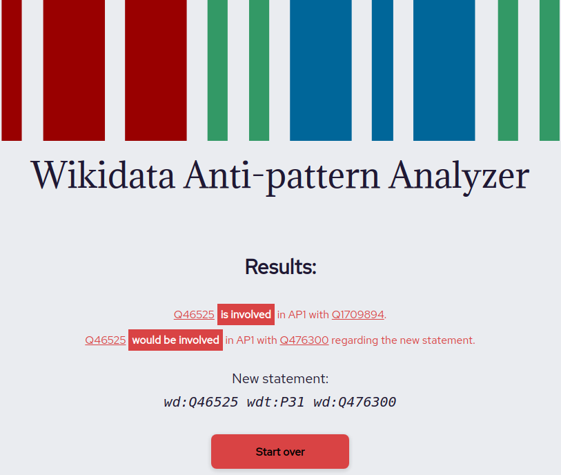

<h1 align="center">
  	<a href="https://atilioa.github.io/WikidataAntipatternAnalyzer/">
		
		 
	 	Wikidata Anti-Pattern Analyzer
    </a>
</h1>

<h4 align="center">

Static website to check for anti-patterns on Wikidata.

</h4>

<h5 align="center">

</h5>

## ℹ About

This is a small static website I built during my undergraduate research (scientific initiation) in 2020-2021. It is capable of checking the existence of AP1 (AP2 coming soon) occurrences given an entity from Wikidata. It can also check if a new statement would introduce new violations. You can learn more about these specific anti-patterns in [this paper by Freddy Brasileiro](https://dl.acm.org/doi/abs/10.1145/2872518.2891117).

Result example (outdated):

 

## 🏡 Running locally

Since this is a plain static website, you just need to clone the repository and open `index.html`.
